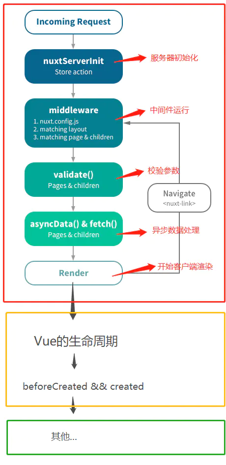

## life cycle



### 生命周期流程图  
___红框内的是Nuxt的生命周期(运行在服务端)，黄框内同时运行在服务端&&客户端上，绿框内则运行在客户端___

1. 红框、黄框内的周期都不存在Window对象
  ```javascript
    export default {
      asyncData() {
        console.log(window) // 服务端报错
      },
      fetch() {
        console.log(window) // 服务端报错
      },
      created () {
        console.log(window) // undefined
      },
      mounted () {
        console.log(window) // Window {postMessage: ƒ, blur: ƒ, focus: ƒ, close: ƒ, frames: Window, …}
      }
    }
  ```

  ### nuxtServerInit

  https://www.jianshu.com/p/a37fd499f0c1


  ```javascript
  import Vuex from 'vuex'

  let store = () => new Vuex.Store({
    state: {
      token: ''
    },
    mutations: {
      setToken (state, token) {
        state.token = token
      }
    },
    actions: {
      nuxtServerInit({ commit }, { req }) {
        let cookie = req.headers.cookie;

        // 将cookie转成json对象（自己实现该方法）
        let token = cookieparse(cookie).token;
        commit('setToken', token);
      },
    }
  })

  export default store
  ```